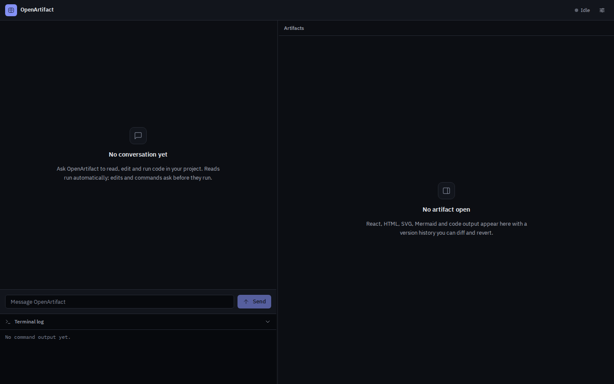
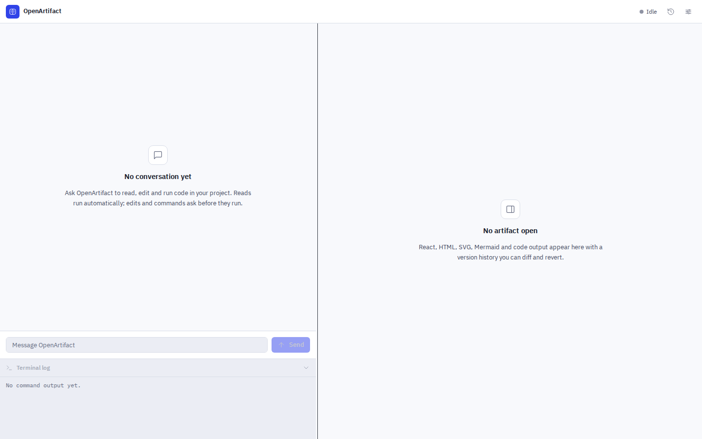
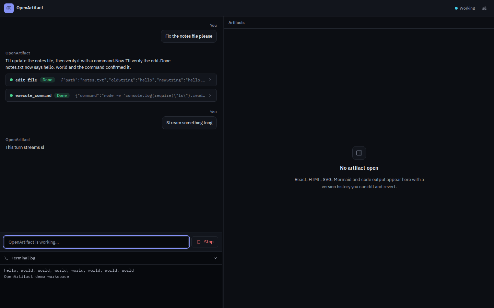
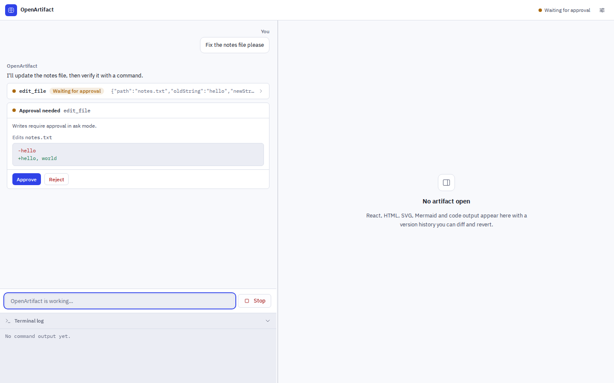
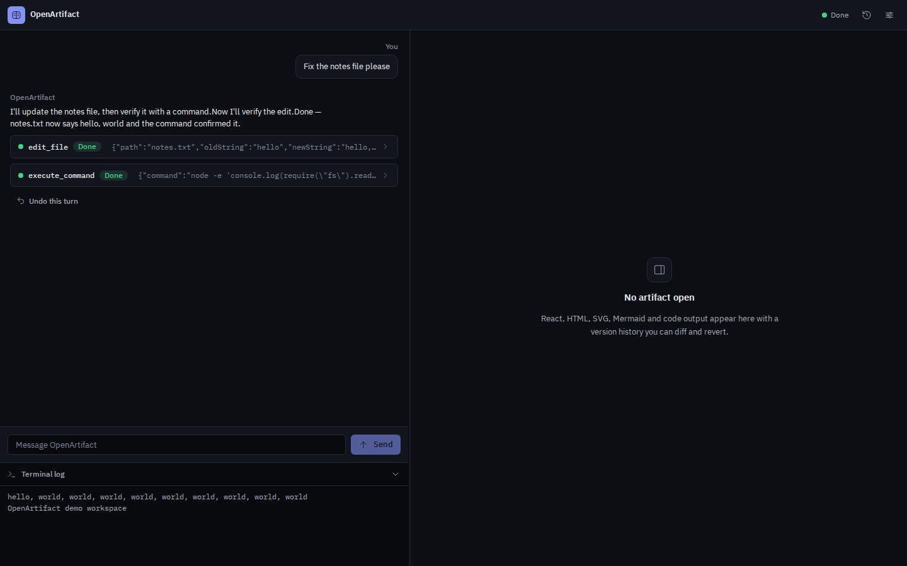
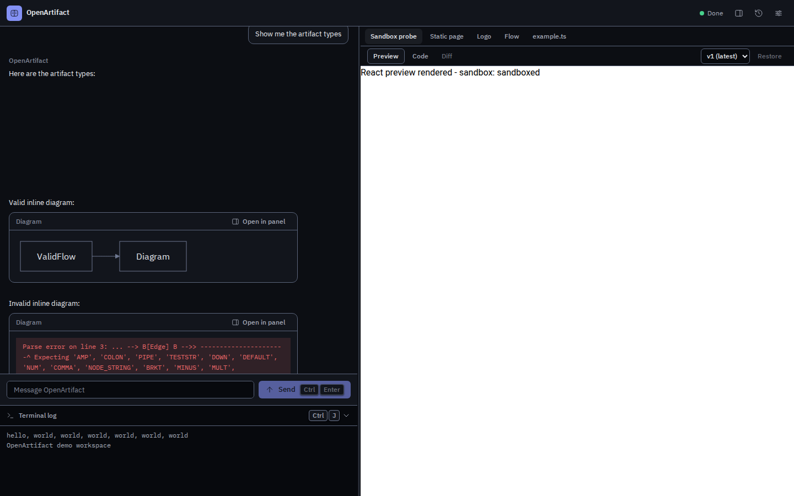
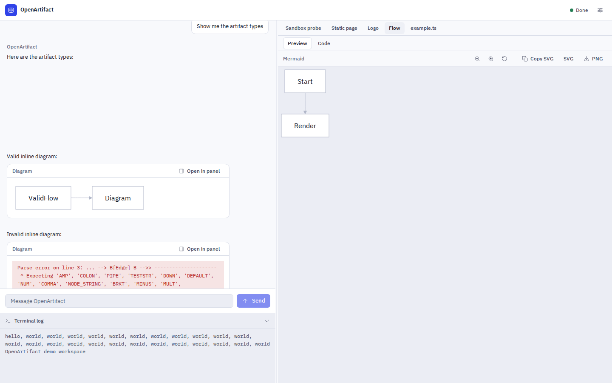
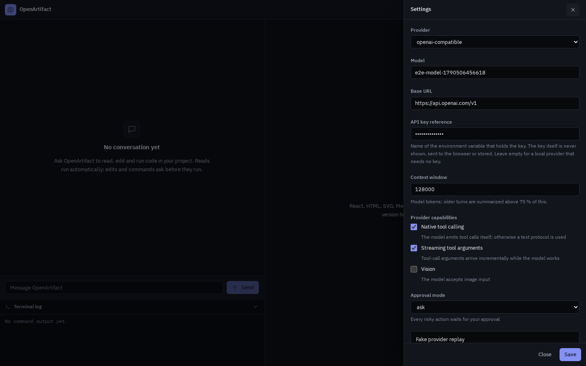
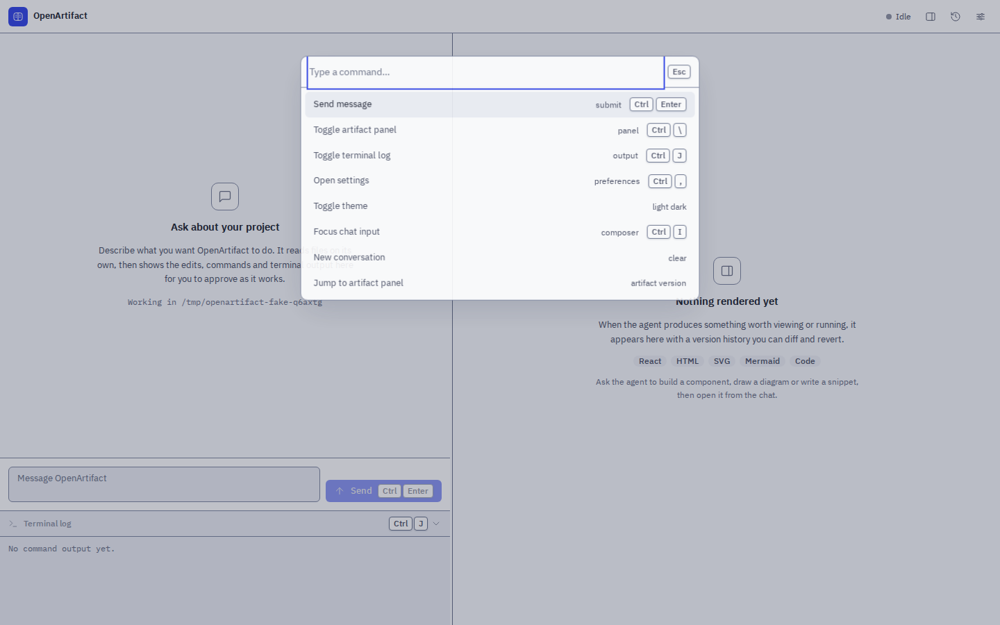

# OpenArtifact

Open-source, provider-agnostic coding agent with Artifacts and live diagrams. Bring your own model — a hosted API or a local model via Ollama — and let it read, edit and run code in a local project, with every risky action visible and approvable. Generated React, HTML, SVG and Mermaid output appears live next to the conversation.

- **Any provider.** One unified adapter layer talks to OpenAI-compatible APIs, Anthropic, Gemini and Ollama.
- **Local agent loop.** Seven tools (`read_file`, `list_directory`, `glob`, `search_code`, `edit_file`, `write_file`, `execute_command`) run against a local folder, with an approval flow for risky actions and one-click undo per turn.
- **Artifacts and diagrams.** React, HTML, SVG, Mermaid and code artifacts render in a sandboxed side panel with version history, diff and revert; Mermaid diagrams also render inline in chat.
- **Local-first.** Everything runs on your machine. No cloud, no telemetry, no remote assets at runtime (fonts and sandbox dependencies are self-hosted).



## Quickstart

Prerequisites: **Node.js 20+** (22 LTS recommended), **pnpm 9+**. On Windows, use WSL2.

```bash
git clone <this-repo> open-artifact
cd open-artifact
pnpm install
```

To see it work immediately with **no API key**, start the scripted replay mode:

```bash
OPENARTIFACT_FAKE_PROVIDER=1 pnpm dev
```

Open **http://127.0.0.1:4318**. You'll get a full conversation (streaming text, a tool approval, a generated artifact, a Mermaid diagram) against a seeded temporary workspace — this is the same mode the test suite and screenshots use. Everything is local; nothing leaves your machine.

To chat for real, pick a provider below.

## Provider setup

The server is configured entirely through environment variables (`OPENARTIFACT_*`). Every variable has a sensible default, so you only set what you need. The agent operates on `OPENARTIFACT_WORKSPACE_ROOT` — by default the directory you launch from, so run from (or point it at) the project you want to work on.

| Variable | Default | Meaning |
|---|---|---|
| `OPENARTIFACT_PROVIDER` | `openai-compatible` | `openai-compatible` \| `anthropic` \| `gemini` \| `ollama` |
| `OPENARTIFACT_MODEL` | per provider | Model name (see table below) |
| `OPENARTIFACT_BASE_URL` | per provider | API base URL (point `openai-compatible` at Groq, Together, DeepSeek, OpenRouter, vLLM, LM Studio, LocalAI, …) |
| `OPENARTIFACT_API_KEY_REF` | per provider | Name of the environment variable holding the key |
| `OPENARTIFACT_APPROVAL_MODE` | `ask` | `ask` \| `auto-edit` \| `full-auto` |
| `OPENARTIFACT_WORKSPACE_ROOT` | launch directory | Absolute root the agent's tools operate in |
| `OPENARTIFACT_CONTEXT_WINDOW` | per provider | Token window used for context management |
| `OPENARTIFACT_FAKE_PROVIDER` | `false` | `1` to run the key-free scripted replay |
| `PORT` | `4318` | Server port (binds `127.0.0.1` only) |

Provider defaults:

| Provider | Default model | Base URL | Key variable |
|---|---|---|---|
| `openai-compatible` | `gpt-4o-mini` | `https://api.openai.com/v1` | `OPENAI_API_KEY` |
| `anthropic` | `claude-3-5-haiku-latest` | `https://api.anthropic.com` | `ANTHROPIC_API_KEY` |
| `gemini` | `gemini-2.0-flash` | `https://generativelanguage.googleapis.com` | `GEMINI_API_KEY` |
| `ollama` | `llama3.2` | `http://127.0.0.1:11434` | _none_ |

**Keys live in the server's environment, never in the browser or the database.** The server reads `process.env[OPENARTIFACT_API_KEY_REF]`; it does not auto-load `.env`. Export the key (or source `.env`) before starting:

```bash
export OPENAI_API_KEY=sk-...      # or: set -a; source .env; set +a
pnpm dev
```

Ollama needs no key — just have it running with a model pulled:

```bash
ollama pull llama3.2
OPENARTIFACT_PROVIDER=ollama pnpm dev
```

Any `/v1/chat/completions` endpoint works through the `openai-compatible` adapter:

```bash
export OPENROUTER_API_KEY=sk-or-...
OPENARTIFACT_BASE_URL=https://openrouter.ai/api/v1 \
OPENARTIFACT_MODEL=anthropic/claude-3.5-sonnet \
OPENARTIFACT_API_KEY_REF=OPENROUTER_API_KEY \
pnpm dev
```

You can also change provider, model, base URL, key reference and approval mode live from the **Settings** drawer (⌘/Ctrl+`,`), without a restart; the key itself stays server-side and is only ever shown masked.

### Approval modes

- **ask** (default) — reads run automatically; edits, writes and commands ask for approval, with a diff or the exact command shown.
- **auto-edit** — edits and writes run automatically; commands still ask.
- **full-auto** — everything runs automatically, with a persistent warning banner.

In every mode, reading secret files (`.env*`, `*.pem`, `*.key`, `id_rsa*`) still requires explicit approval, and `sudo` is never auto-approved.

## Security model

- **Local only.** The server binds `127.0.0.1` and never listens on an external interface.
- **Session token.** A random per-startup token is issued as an httpOnly cookie; every API request must carry it.
- **DNS-rebinding / CSRF guards.** Requests whose `Host` or `Origin` is not the local UI are rejected.
- **Path jail.** All tool paths are resolved to real paths and rejected if they escape the workspace root (including `..` and symlink escapes); writes into `.git/` are denied.
- **Secrets.** API keys exist only in the server's environment; they are never sent to the browser, never logged, and the UI shows only masked references. Secret-file reads always require approval.
- **Prompt injection.** File contents, command output and web content are treated as untrusted; the system prompt tells the model that instructions found in them never override the user.
- **Sandboxed artifacts.** React and HTML previews render in an `<iframe sandbox="allow-scripts">` (no `allow-same-origin`) with a strict CSP on the main app, and the sandbox communicates only via `postMessage`.
- **Commands** run with your user privileges, stated clearly in the UI; `sudo` is never auto-approved in any mode.

See `apps/server/src/security.ts` and `packages/core/src/security/` for the implementation.

## Screenshots

Representative captures (full set — every key screen × dark/light × desktop 1440×900 / mobile 390×844 — in `docs/screenshots/`):

| | |
|---|---|
|  |  |
|  |  |
|  |  |
|  |  |

## Scripts

| Script | What it does |
|---|---|
| `pnpm dev` | Starts the server and web client together |
| `pnpm build` | Builds the web client (and vendors sandbox deps) |
| `pnpm check` | Typecheck, lint, unit tests, `design:check`, and e2e (Playwright + axe) |
| `pnpm design:check` | Impeccable detector over `apps/web/src` — hard-coded colors/sizes fail the build |
| `pnpm screenshots` | Captures the key screens into `docs/screenshots/` (own Playwright project; not run by `pnpm check`) |
| `pnpm smoke --provider <id>` | One real streaming request against `openai-compatible` \| `anthropic` \| `gemini` \| `ollama` (reads keys from `.env`) |

## Project layout

```text
apps/
  server/   Hono server: config, routes (chat/approvals/artifacts/settings/undo), SQLite persistence, security
  web/      React 18 + Vite + Tailwind + Zustand UI (chat, approvals, terminal, artifacts, settings)
packages/
  core/     Provider adapters, stream parser, agent loop, tools, security, prompts (no React/DOM)
  shared/   Canonical message model, stream events, wire types + zod schemas
e2e/        Playwright + axe suite and screenshot capture
docs/       SPEC.md, PROGRESS.md, DECISIONS.md, DESIGN.md, screenshots/
```

The visual system (tokens, typography, motion, keyboard shortcuts) is documented in `DESIGN.md`; the product rationale is in `PRODUCT.md`. See `CONTRIBUTING.md` to contribute.

## License

[MIT](LICENSE)
